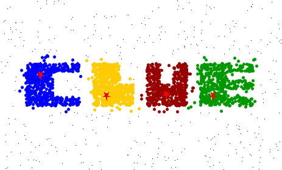

# Standalone CLUE Algorithm on GPU and CPU

Z.Chen[1], A. Di Pilato[2,3], F. Pantaleo[4], M. Rovere[4], C. Seez[5]

*[1] Northwestern University, [2]University of Bari, [3]INFN, [4] CERN, [5]Imperial College London*

## 1. Setup

The pre-requisite dependencies are `>=gcc7`, `<=gcc8.3`, `Boost`, `TBB`. Fork this repo if developers.

If CUDA/nvcc are found on the machine, the compilation is performed automatically also for the GPU case.
The path to the nvcc compiler will be automatically taken from the machine. In this case, `>=cuda10` and `<=nvcc11.2` are also required.

* **On a CERN machine with GPUs:** Source the LCG View containing GCC, Boost
and CUDA:
```bash
source /cvmfs/sft.cern.ch/lcg/views/LCG_102cuda/x86_64-centos7-gcc8-opt/setup.sh

# then setup this project
git clone --recurse-submodules https://gitlab.cern.ch/kalos/clue.git
cd clue
cmake -S . -B build
cmake --build build

# if installation is needed
mkdir install
cd build/ ; cmake .. -DCMAKE_INSTALL_PREFIX=../install; make install
```

* **On an Ubuntu machine with GPUs:** Install Boost and TBB first.
```bash
sudo apt-get install libtbb-dev
sudo apt-get install libboost-all-dev

# then setup this project
git clone --recurse-submodules https://gitlab.cern.ch/kalos/clue.git
cd clue
make
```

### 2. Run CLUE
CLUE needs three parameters:
  * `dc`
  * `rhoc`
  * `outlierDeltaFacto`

1. _dc_ is the critical distance used to compute the local density.
1. _rhoc_ is the minimum local density for a point to be promoted as a Seed.
1. _outlierDeltaFactor_ is  a multiplicative constant to be applied to `dc`.

The test program accept the following parameter from the command line:

* `-i input_filename`: input file with the points to be clustered
* `-d critical_distance`: the critical distance to be used
* `-r critical_density`: the critical density to be used
* `-o outlier_factor`: the multiplicative constant to be applied as outlier
  rejection factor
* `-e sessions`: number of times the clustering algorithm has to run on the
  same input dataset. That's useful to have a more reliable measure of the
  timing performance.
* `-t number_TBB_threads`: set the number of TBB threads to be used (when this
  makes sense)
* `-u use_accelerator`: enable the GPU version of the executable run. Every
  single executable, in fact, has both the CPU and the GPU version embedded.
* `-v verbose`: activate verbose output. Among other things, this will also
  enable the saving of the results of the clustering steps in local text files.

If the projects compiles without errors, you can go run the CLUE algorithm by
```bash
./build/src/clue/main -i data/input/aniso_1000.csv -d 7.0 -r 10.0 -o 2 -e 10 -v -u

# in case of only CPU
./build/src/clue/main -i data/input/aniso_1000.csv -d 7.0 -r 10.0 -o 2 -e 10 -v
```

The input files are `data/input/*.csv` with columns 
* x, y, layer, weight

The output files are `data/output/*.csv` with columns
* x, y, layer, weight, rho, delta, nh, isSeed, clusterId

If you encounter any error when compiling or running this project, please
contact us.

## 3. Examples
The clustering result of a few synthetic dataset is shown below


## 4. Performance on Toy Events
We generate toy events on toy detector consist of 100 layers.
The average execution time of toy events on CPU and GPU are shown below

